# Charity Sphere

## Module Connection Diagram

```mermaid
flowchart TD
    app --> mod_auth{{Authentication}}
    mod_auth --> logi(Login) & regi(Registration)
    regi <--> logi --> dash(Dashboard)

    dash --> dona(🪙 Donate)
    dash --> voln(👤 Volunteer)
    dash --> inst(🏢 Institutions)
    dash --> anal[[Analytics]]
    dash --> prof(Profile)
    dash --> mod_emerg{{🗺️ Emergency Mode}}
    dash --> mod_ai{{✨ AI Chatbot}}

    prof --> dono(👤 Donors) & inst & voln

    inst --CRUD--> voln
    inst --CRUD--> mod_fund{{Fundraise}}
    inst --CRUD--> mod_task{{Tasks}} --> voln
    dono & inst & voln --> dona --> mod_fund
    mod_fund --> mod_pay{{Payments}}
```



## Requirements

#### 1. Authentication and Authorization

- [ ] Register an account (Roles: Donor, Institution, Volunteer)
- [ ] Show error messages on unsuccessful login
- [ ] Redirect to dashboard on successful login
- [ ] Redirect to login page on logout

- [ ] Register with Google/Facebook OAuth

#### 9. Profile and Settings

- [ ] View profile
- [ ] Update username and profile picture
- [ ] Donation History
- [ ] Delete account

## 🆕 Initializing Project

### Step 1: Clone the project

```sh
git clone git@github.com:CharitySphere/CharitySphere.git
```

### Step 2: Initialize Virtual Environment (Recommended)

Install Python and execute following commands:

```sh
python -m pip install virtualenv
python -m venv venv
```

### Step 3: Activate Virtual Environment

Using the command based on your current shell

```sh
# Powershell
.\ENV\Scripts\Activate.ps1
# CMD
ENV\Scripts\activate.bat
# Bash and Zsh
source ENV/bin/activate
# Fish
source ENV/bin/activate.fish
```

### Step 4: Install Requirements

```sh
pip install -r requirements.txt
```

### Step 5: Create Admin Account (optional)

```sh
python manage.py createsuperuser
```

## 🏃 Running Project

Execute `runserver.bat` if you are on Windows. <br>
Or run server manually by doing the following steps:

### Step 1: Activate Virtual Environment

Using the command based on your current shell

```sh
# CMD
ENV\Scripts\activate.bat
# Powershell
.\ENV\Scripts\Activate.ps1
# Bash and Zsh
source ENV/bin/activate
# Fish
source ENV/bin/activate.fish
```

### Step 2: Run Server

```sh
python manage.py runserver
```

Open [http://localhost:8000](http://localhost:8000) or [http://127.0.0.1:8000](http://127.0.0.1:8000) on your browser

## Command History

```sh
pip install Django
mkdir CharitySphere
django-admin startproject app CharitySphere

git remote add origin git@github.com:CharitySphere/CharitySphere.git
git add .
git commit -m "init: Initialized Django"
git push -u origin master
```
