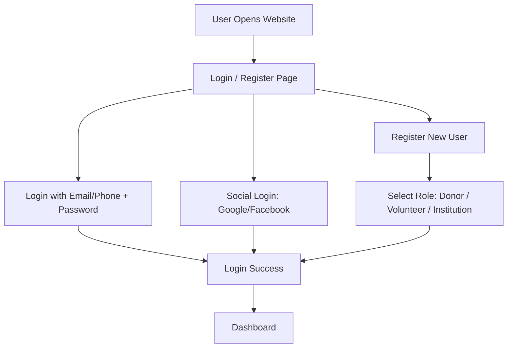
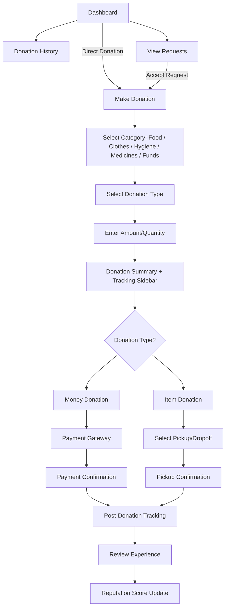
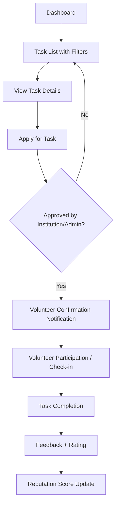
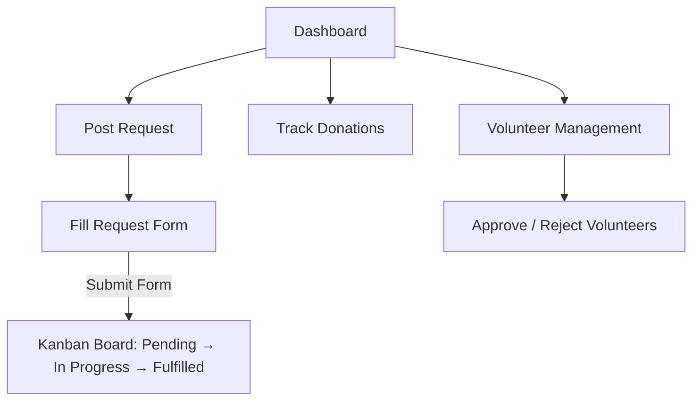
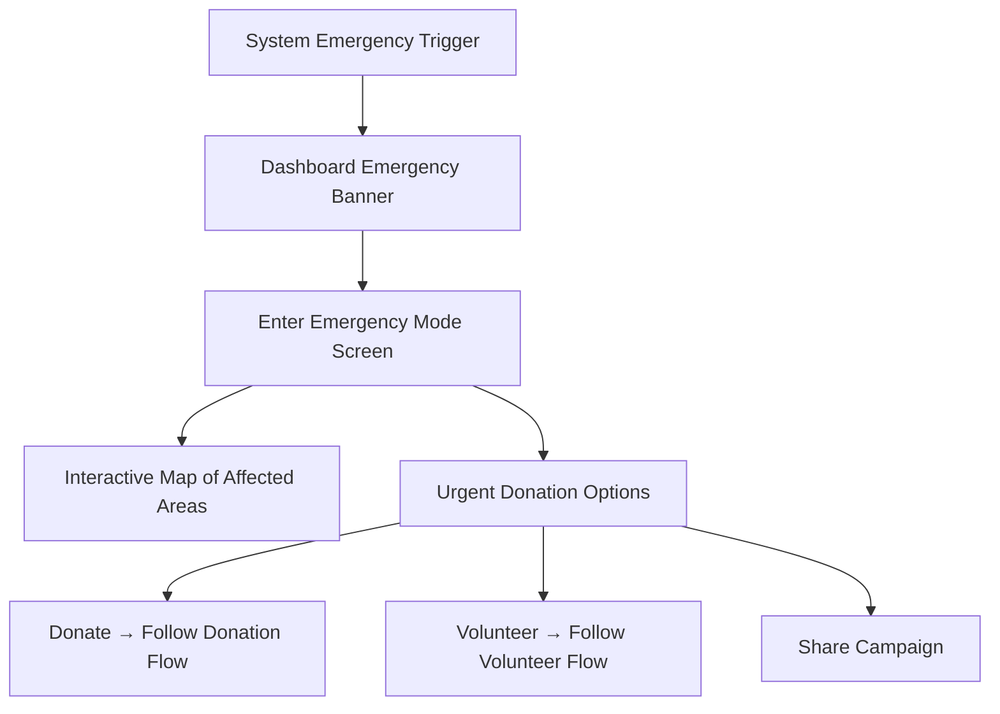
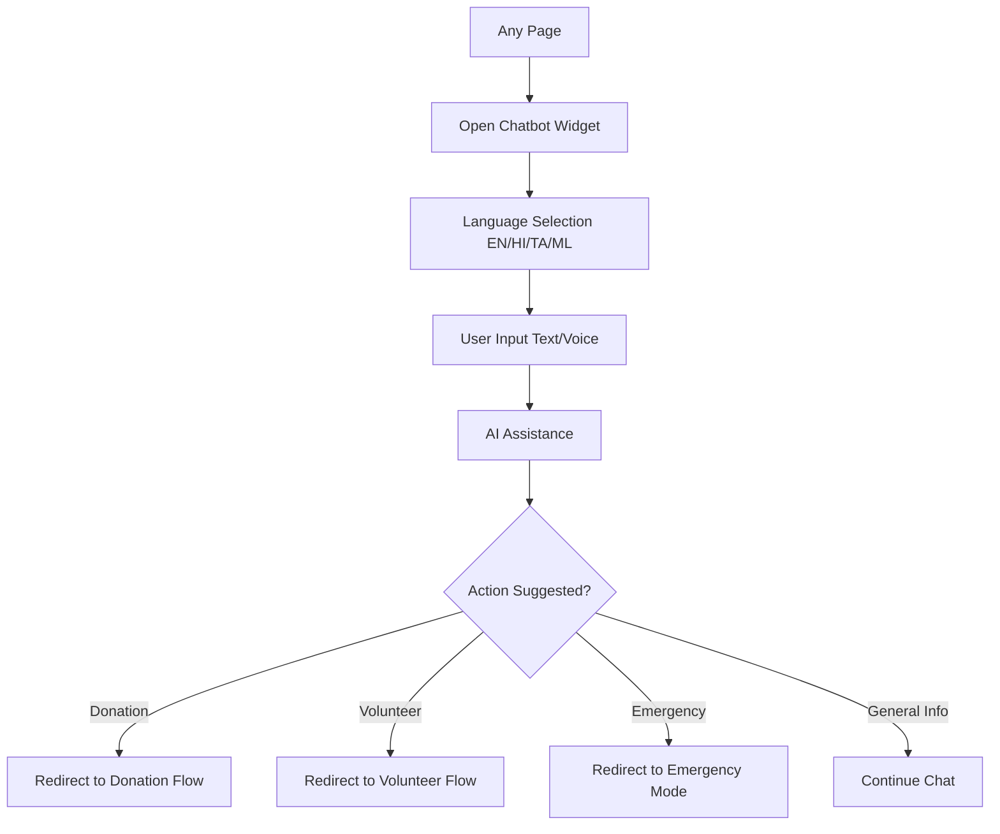
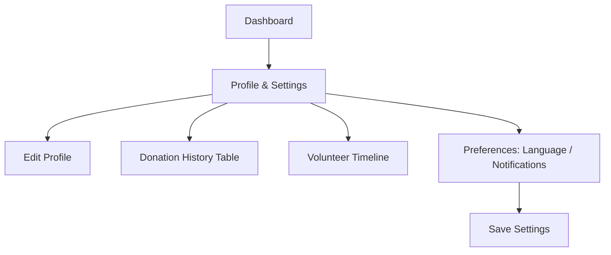
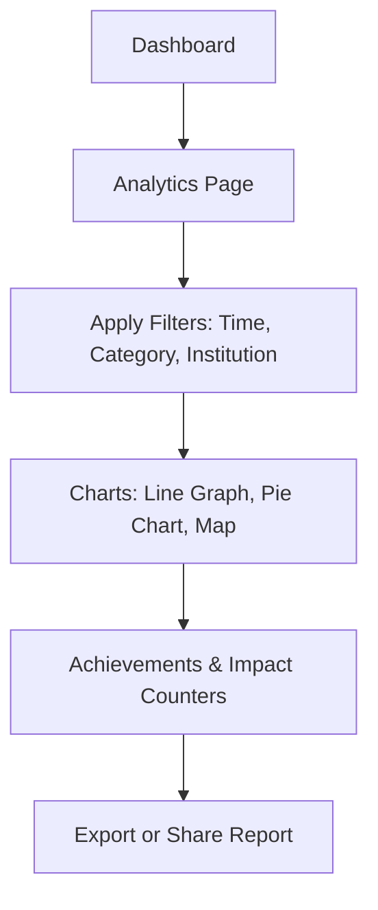

## User-Flow Diagram

### Authentication

```mermaid
flowchart TD
    A[User Opens Website] --> B[Login / Register Page]

    B --> C[Login with Email/Phone + Password]
    B --> D[Social Login: Google/Facebook]
    B --> E[Register New User]

    E --> F[Select Role: Donor / Volunteer / Institution]

    C --> G[Login Success]
    D --> G
    F --> G

    G --> H[Dashboard]
```

### Donor

```mermaid
flowchart TD
    A[Dashboard] --> B[Donation History]
    A -- Direct Donation --> B3
    A --> B2[View Requests]
    B2 -- Accept Request --> B3[Make Donation]
    B3 --> C[Select Category: Food / Clothes / Hygiene / Medicines / Funds]

    C --> D[Select Donation Type]
    D --> E[Enter Amount/Quantity]

    E --> F[Donation Summary + Tracking Sidebar]

    F --> G{Donation Type?}
    G --> H[Money Donation]
    H --> H1[Payment Gateway]
    H1 --> H2[Payment Confirmation]
    G --> I[Item Donation]
    I --> I1[Select Pickup/Dropoff]
    I1 --> I2[Pickup Confirmation]

    H2 --> J[Post-Donation Tracking]
    I2 --> J

    J --> K[Review Experience]
    K --> L[Reputation Score Update]
```

### Volunteer

```mermaid
flowchart TD
    A[Dashboard] --> C[Task List with Filters]

    C --> D[View Task Details]
    D --> E[Apply for Task]

    E --> F{Approved by Institution/Admin?}
    F -->|Yes| G[Volunteer Confirmation Notification]
    F -->|No| C

    G --> H[Volunteer Participation / Check-in]
    H --> I[Task Completion]

    I --> J[Feedback + Rating]
    J --> K[Reputation Score Update]
```

### Institution

```mermaid
flowchart TD
    B[Dashboard]

    B --> C[Post Request]
    C --> D[Fill Request Form]
    D -- Submit Form --> E[Kanban Board: Pending → In Progress → Fulfilled]

    B --> F[Track Donations]
    B --> G[Volunteer Management]

    G --> H[Approve / Reject Volunteers]
```

### Emergency Mode

```mermaid
flowchart TD
    A[System Emergency Trigger] --> B[Dashboard Emergency Banner]

    B --> C[Enter Emergency Mode Screen]

    C --> D[Interactive Map of Affected Areas]
    C --> E[Urgent Donation Options]

    E --> F[Donate → Follow Donation Flow]
    E --> G[Volunteer → Follow Volunteer Flow]
    E --> H[Share Campaign]
```

### AI Chatbot

```mermaid
flowchart TD
    A[Any Page] --> B[Open Chatbot Widget]

    B --> C[Language Selection EN/HI/TA/ML]
    C --> D[User Input Text/Voice]

    D --> E[AI Assistance]

    E --> F{Action Suggested?}
    F -->|Donation| G[Redirect to Donation Flow]
    F -->|Volunteer| H[Redirect to Volunteer Flow]
    F -->|Emergency| I[Redirect to Emergency Mode]
    F -->|General Info| J[Continue Chat]
```

### Profile and Settings

```mermaid
flowchart TD
    A[Dashboard] --> B[Profile & Settings]

    B --> C[Edit Profile]
    B --> D[Donation History Table]
    B --> E[Volunteer Timeline]
    B --> F[Preferences: Language / Notifications]

    F --> G[Save Settings]
```

### Analytics

```mermaid
flowchart TD
    A[Dashboard] --> B[Analytics Page]

    B --> C[Apply Filters: Time, Category, Institution]
    C --> D[Charts: Line Graph, Pie Chart, Map]

    D --> E[Achievements & Impact Counters]
    E --> F[Export or Share Report]
```
