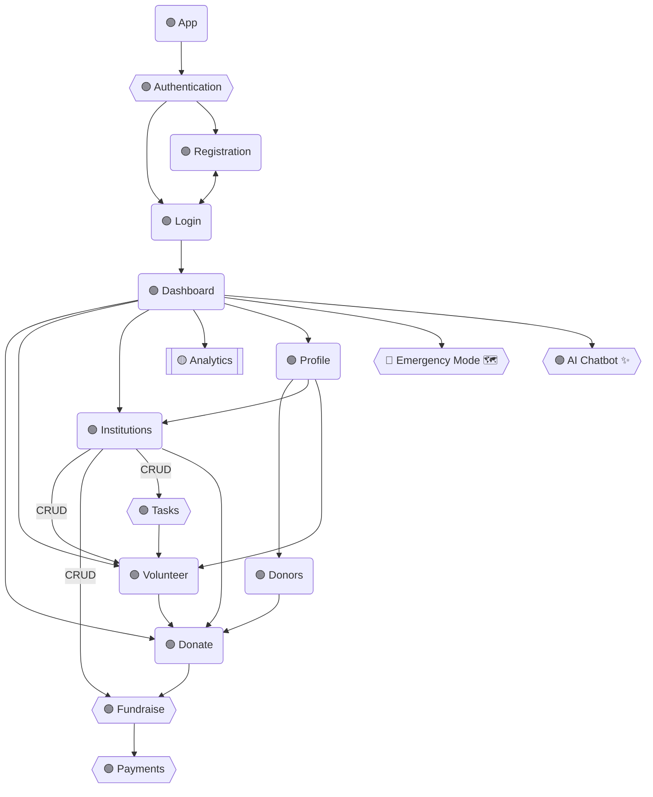

## Functional Requirements

### 1. Authentication and Authorization

- [x] Register an account (Roles: Donor, Institution, Volunteer)
- [x] Show error messages on unsuccessful login
- [x] Redirect to dashboard on successful login
- [x] Redirect to login page on logout
- [ ] Register with Google/Facebook OAuth

### 3. Donation Interface (Money + Items)

- [x] Category menu (Food, Clothes, Hygiene, Medicines, Funds).
- [x] Item/Amount selection.
- [x] Donation summary + real-time tracker.
- [ ] Payment Gateway integration (Needs business reg + PAN)

### 4. Volunteer Management Dashboard

- [x] Table View: List of available volunteer tasks.
- [x] Columns → Task Name | Institution | Date | Location | Status | Action.
- [x] Filter by Date, Location, Task Type.

### 2. Home Dashboard

- [x] Logo, Search bar, Notification Bell, Profile Icon.
- [x] Quick links (Home, Donate, Volunteer, Institutions, Analytics, Settings).
- [x] Banner with urgent alerts (flood relief, food drive).
- [ ] Cards showing nearby donation requests.
- [ ] Carousel with featured causes.
- [x] Can display multiple donation campaigns in 3-column grid format.

### 9. Profile and Settings

- [x] View profile
- [x] Update Name and details
- [x] Delete account
- [x] Donation History

### 5. Institution Management Screen

- [x] Institution options (Post Request, Track Donations, Volunteer Management).
- [x] “Post a Request” form with dropdowns.
- [x] Requests displayed in a Kanban Board (Pending, In Progress, Fulfilled).
- [x] Large board view to manage multiple requests simultaneously.

### 7. AI Chatbot Panel

- [ ] Chatbot opens in bottom-right corner popup (like support bots on websites).
- [ ] Can switch to full-screen conversational view if needed.
- [ ] Text input.
- [ ] Multilingual switch (English, Hindi, Tamil, Malayalam).
- [ ] Sentiment detection (shows alert if message sounds urgent).

## Module Architecture



## Raw Data

```
CharitySphere – Web Interface
1. Login & Registration Page
Layout:
Left side → Inspirational image (helping hands, donations).
Right side → Login/Signup form.
Features:
Email/Phone + Password login.
Role Selection Dropdown (Donor / Volunteer / Institution).
“Register with Google/Facebook” buttons.
2FA (OTP popup for verification).

2. Home Dashboard
Layout:
Top Navbar: Logo, Search bar, Notification Bell, Profile Icon.
Left Sidebar: Quick links (Home, Donate, Volunteer, Institutions, Analytics, Settings).
Main Panel:
Banner with urgent alerts (flood relief, food drive).
Cards showing nearby donation requests.
Carousel with featured causes.
Can display multiple donation campaigns in 3-column grid format.

3. Donation Interface (Money + Items)
Layout:
Left Column: Category menu (Food, Clothes, Hygiene, Medicines, Funds).
Center Panel:
Item/Amount selection.
Payment Gateway integration.
Right Sidebar: Donation summary + real-time tracker.
Side-by-side donation and tracking view (bigger space than mobile).

4. Volunteer Management Dashboard
Layout:
Table View: List of available volunteer tasks.
Columns → Task Name | Institution | Date | Location | Status | Action.
Top Bar: Filter by Date, Location, Task Type.
Easy to show large lists with sorting & filtering (Excel-like view).

5. Institution Management Screen
Layout:
Left Sidebar: Institution options (Post Request, Track Donations, Volunteer Management).
Main Panel:
“Post a Request” form with dropdowns.
Requests displayed in a Kanban Board (Pending, In Progress, Fulfilled).
Large board view to manage multiple requests simultaneously.

6. Emergency & Disaster Mode Screen
Layout:
Top Banner (Red): Active emergency alerts (e.g., Kerala Flood Relief).
Center Panel: Interactive map showing affected areas with markers for
needs.
Right Sidebar: Urgent donation options (Water, Food Packets, Medicines).
Full-screen Google Maps integration with zoom-in details of donation
points.

7. AI Chatbot Panel
Layout:
Chatbot opens in bottom-right corner popup (like support bots on websites).
Can switch to full-screen conversational view if needed.
Features:
Text input.
Multilingual switch (English, Hindi, Tamil, Malayalam).
Sentiment detection (shows alert if message sounds urgent).Larger screen allows parallel chatbot + dashboard usage.

8. Reputation & Trust System Page
Layout:
Left Panel: Leaderboards (Top Donors, Top Volunteers, Trusted
Institutions).
Center: Reputation score meter (gauge chart).
Right Panel: Recent reviews & feedback.
Can display detailed graphs + tables together without scrolling.

9. Profile & Settings Screen
Layout:
Top Section: Profile photo, name, role, edit button.
Tabs Below:
Donation History → Table with filters.
Volunteer History → Timeline.
Preferences → Language, Notifications, Alert Type.
Tab-based design, showing history + settings side by side.

10. Analytics & Impact Visualization
Layout:
Dashboard Style:
Left Sidebar → Filter (Time, Category, Institution).
Main Section → Graphs & Charts.
Line Graph → Donations over time.
Pie Chart → Contribution by category.
Map → Regional distribution of donations.
Right Sidebar → Achievements & counters (Meals served, Clothes donated).
Can present multi-graph dashboards like Google Analytics.
```
