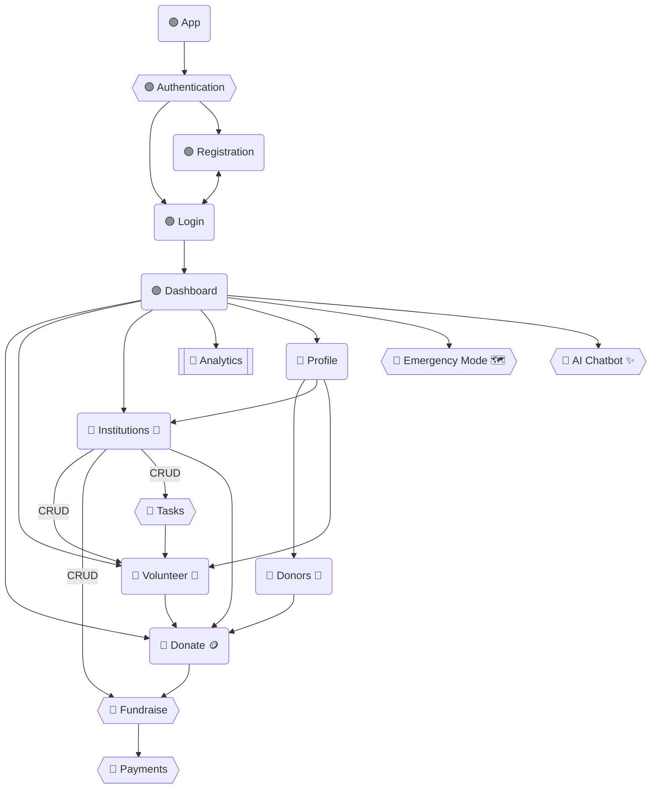

## Functional Requirements

#### 1. Authentication and Authorization

- [x] Register an account (Roles: Donor, Institution, Volunteer)
- [x] Show error messages on unsuccessful login
- [x] Redirect to dashboard on successful login
- [x] Redirect to login page on logout
- [ ] Register with Google/Facebook OAuth

#### 9. Profile and Settings

- [x] View profile
- [x] Update Name and details
- [x] Delete account
- [ ] Donation History

## Module Architecture

